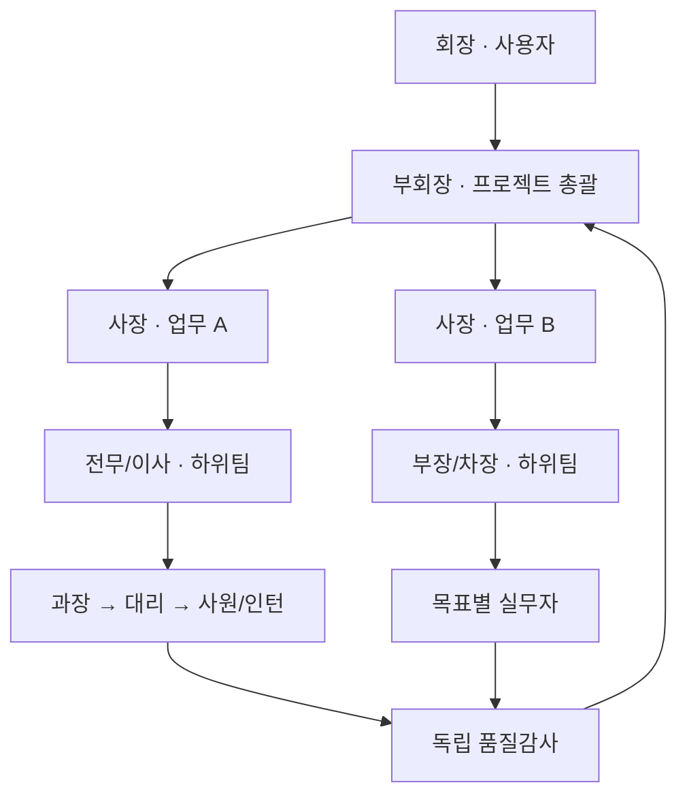
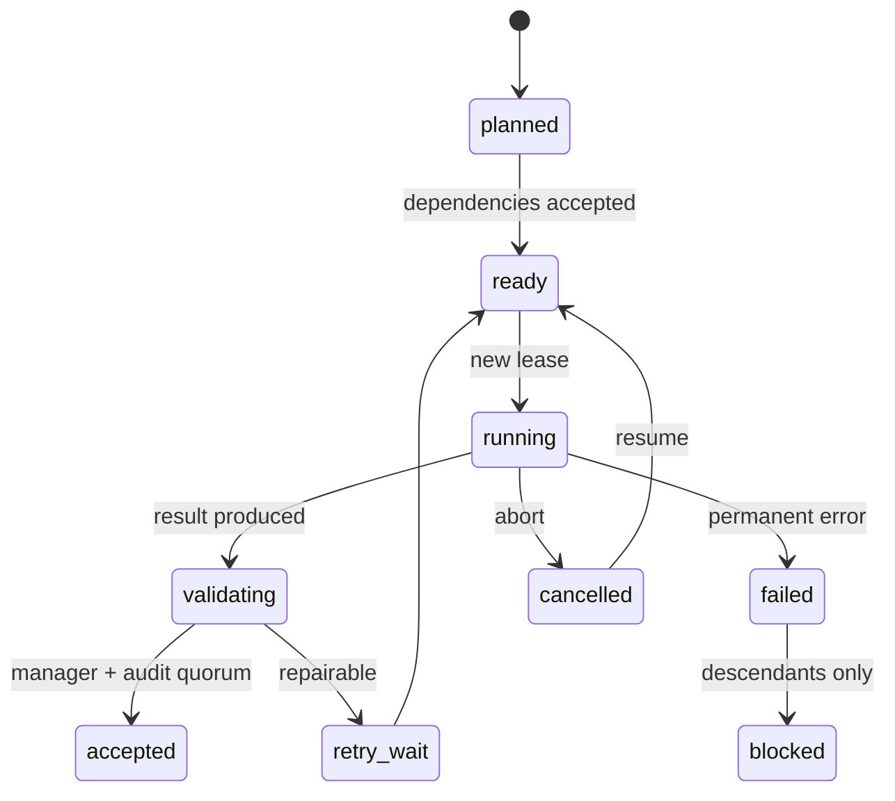

# Luna Swarm

ChatGPT 로그인으로 `gpt-5.6-luna`를 사용하는 **수직 조직형 다중 에이전트 오케스트레이터**입니다. 동시 호출 100은 하드 캡이 아닙니다. 기본 상한은 128, 설정 가능 상한은 1,024이며, 처음에는 8개만 실행해 계정과 서버 상태에 맞춰 적응합니다.

핵심은 “같은 질문을 100번”이 아닙니다. 목표를 DAG로 나누고, 서로 다른 책임과 정보 경계를 가진 조직이 기획 → 실행 → 부서 검토 → 독립 감사 → 계층 병합 → 최종 심의를 수행합니다.

## 5분 시작

필요 조건은 Node.js 20 이상과 ChatGPT 계정입니다.

```bash
npm install
npx codex login
npm run build
npm start -- doctor
```

먼저 비용 없는 결정론적 모의 실행으로 설치를 확인합니다.

```bash
npm start -- run \
  --goal "이 제품 아이디어의 기술·시장·운영 위험을 분석해 실행안을 만들어라" \
  --mock
```

실제 Luna 실행:

```bash
npm start -- run \
  --goal "이 저장소의 구조를 분석하고 가장 효과가 큰 개선안을 근거와 함께 제시해라" \
  -- --workspace /absolute/path/to/project
```

웹에서 조직을 실제 픽셀 회사처럼 관찰하고 지휘하려면 React/Pixi 운영 콘솔을 엽니다.

```bash
npm start -- ui --workspace . --open

# 모델 호출 없는 30명 시뮬레이션
npm start -- ui --workspace . --mock --open
```

기본 주소는 `http://127.0.0.1:4310`입니다. 새 UI는 React가 메뉴·명부·제어·조직도·DAG를, PixiJS가 구조화된 tile map·벽·가구·좌석·직원 entity·A* 이동·보고 애니메이션을 렌더링합니다. 참고 이미지를 배경 한 장으로 사용하지 않습니다. REST 초기 snapshot 이후 `/api/ui/events` WebSocket에서 실행별 `seq`를 이어받고, 재연결 시 마지막 `seq` 이후 사건을 replay합니다.

본사 층은 Pixel Agents의 “런타임 상태를 실제 공간 행동으로 번역한다”는 원칙을 Luna의 대규모 실행에 맞게 확장합니다. 조사 직원은 근거 서가, 회의 직원은 공유 회의실, 차단 직원은 incident room, 대기 직원은 라운지, 승인·보고 직원은 report lift로 제한된 인원만 이동합니다. 부서 내부에는 방향이 있는 좌석과 모니터·의자·4~6인 포드가 남아 있어 직원이 이동해도 빈 상자가 아니라 회사로 읽힙니다. Pixel Agents의 코드나 에셋은 복제하지 않았습니다.

144명 화면에서도 타일·벽·가구는 정적 Pixi 레이어로 한 번만 만들고, 상태·선택이 바뀐 경우에만 직원 레이어를 교체합니다. 진행률 숫자만 갱신되는 1초 snapshot은 지도 전체를 다시 만들지 않습니다. 동시에 이동하는 직원은 최대 24명, 말풍선은 기본 최대 20개로 제한하고 렌더러는 DPR 1.25·30fps 상한을 사용합니다. 네 방향 직원 atlas는 초기 preload 후 파일별로 독립 재시도하며, 일부 방향 이미지가 실패하면 정상 시트로 대체하고 마지막 정상 장면을 유지합니다. 오류 배너의 `이미지 다시 불러오기`는 실패한 Pixi 캐시까지 우회합니다.

UI 서버가 시작한 실행은 `소유 실행`으로 표시되어 일시정지·재개·전체 취소·동시성 cap·다음 turn 지시·시작 전 작업 우선순위/취소를 제어할 수 있습니다. 별도 CLI에서 시작한 실행은 동일한 상태와 사건을 관찰하되 `외부 실행 · 관찰 전용`으로 표시합니다. 제어 API는 loopback Host/Origin을 확인하며, 비-loopback bind에는 `--token`이 필요합니다.

본사 지도는 직원 ID로 좌석을 결정하고 동서남북 착석 atlas를 좌석 방향에 맞춰 사용합니다. 이동 중인 직원은 16개 전신 sprite를 사용합니다. 생성 과정에서 잘렸던 원본 4번째 행은 `employee-atlas-v2.png`에서 투명 192×192 셀 안으로 복원했고, 각 셀의 여백을 자동 검증했습니다. 144명까지 개별 entity를 동시에 표시하고, 더 큰 조직은 선택 부서를 개별 표시하면서 현재 층/전체 인원을 분리해 알립니다.

기존 Canvas 2D 대시보드는 호환 경로로 `npm start -- dashboard --workspace .`에서 계속 실행할 수 있습니다. **회장 명령석**에서는 세 가지 작업을 할 수 있습니다.

- `현재 프로젝트에 지시`: 진행 중인 실행의 append-only 명령 큐에 자연어 지시를 기록합니다. 이미 실행 중인 모델 호출은 바꾸지 않고 다음 planning/DAG/validation/synthesis/judge 체크포인트부터 전 조직에 반영합니다. 브라우저 요청 ID로 재전송을 중복 없이 처리합니다.
- `새 프로젝트 · 실제`: 입력한 목표로 실제 Luna 실행을 시작합니다.
- `새 프로젝트 · 모의`: 모델 호출 없이 전체 회사 흐름을 확인합니다.

종료된 실행에는 새 지시를 넣을 수 없으며, 이미 승인된 결과는 소급해 다시 실행하지 않습니다. 중간에 프로세스를 재개해도 적용된 회장 지시는 유지됩니다.

이 프로젝트는 자식 Codex 프로세스에서 `OPENAI_API_KEY`와 `CODEX_API_KEY`를 제거합니다. 즉 API 과금 경로를 선택하지 않고, `codex login`으로 저장된 ChatGPT 인증만 사용합니다.

> 계정 화면의 “무료/무제한” 표시는 ChatGPT 사용 권한을 뜻합니다. 100개 이상의 동시 요청을 서버가 항상 수용하거나 정책이 영구히 유지된다는 보장은 아닙니다. 그래서 숫자를 고정하지 않고 실제 동시성을 자동 조절합니다.

## 목표마다 새로 만드는 수직 조직



사용자는 항상 회장입니다. Architect가 목표의 크기와 종류를 보고 부회장→사장→전무→이사→부장→차장→과장→대리→사원→인턴 중 필요한 직급만 골라 프로젝트 조직을 만듭니다. 작은 작업은 직급을 건너뛰고, 큰 작업은 폭과 깊이를 늘립니다.

각 팀에는 `parentTeamId`, `leadRank`, `leadRole`이, 실무 작업에는 `teamId`, `assigneeRank`, `department`, `ownerRole`이 붙습니다.

- 네 부서장이 서로 보지 않고 독립 기획안을 작성합니다.
- 부회장/수석 아키텍트가 중복과 충돌을 제거하고 하나의 DAG와 조직 트리로 승인합니다.
- 실무 담당은 자기 작업 계약과 이미 승인된 의존 결과만 받습니다.
- 직속 팀장이 결과에 책임을 지고 1차 검토합니다.
- 품질감사팀은 부서장 의견과 다른 감사표를 보지 않고 블라인드 투표합니다. 먼저 결론을 결정할 수 있는 최소 인원만 호출하고, 표가 갈릴 때만 다음 감사자를 순차 투입합니다.
- 직속 팀장 승인 **그리고** 감사 정족수(기본 2/3)가 모두 필요합니다.
- 같은 깊이의 팀장은 병렬로 보고서를 만들고, 상위 팀장은 직속 하위팀의 압축 보고가 모두 도착한 뒤 시작합니다.
- 원본 실무 결과는 계층을 건너뛰지 않습니다. 각 관리자는 직접 보고와 직속 하위팀 보고만 종합합니다.
- 모든 관리 계층은 원본 작업 ID의 정확한 합집합을 보존해야 합니다.
- 독립 final critic이 루트 보고의 요구사항·출처 한계·실패 모드·과도한 확신을 red-team하고 그 표를 최종 심의관에게 전달합니다.
- 최종 심의관이 사용자 요구사항 커버리지를 검사하고, 누락 시 한 번 더 수정을 요구합니다.

기본 역할표와 실행별 동적 조직도 확인:

```bash
npm start -- org
npm start -- org <run-id>
```

전체 직급을 펼친 형태는 [examples/reference-vertical-organization.md](examples/reference-vertical-organization.md)에 있습니다. 각 실행은 `<run>/organization.md`에 실제 생성된 Mermaid 조직도를 남깁니다.

## 왜 SDK 100개가 아닌가

`@openai/codex-sdk`의 각 `thread.run()`은 내부적으로 별도 `codex exec` 프로세스를 실행합니다. 이를 100개 병렬화하면 CLI 프로세스, 메모리, 파일 디스크립터와 ChatGPT 인증 갱신이 동시에 경쟁합니다.

Luna Swarm은 SDK를 모델 실행에 직접 사용하지 않습니다. SDK 패키지에 포함된 공식 Codex 바이너리를 찾아 **`codex app-server` 프로세스 하나**를 띄우고, 그 연결 안에서 많은 thread와 turn을 운영합니다. 모든 기획자·관리자·실무자·감사자·통합자·심의자 호출은 하나의 전역 동시성 관문을 통과합니다.

## 더 똑똑하게 만드는 장치

| 장치 | 같은 모델에서도 도움이 되는 이유 |
|---|---|
| 역할 헌장 | 임무, 결정권, 보고선과 평가 기준이 달라 동일 답안 복제를 줄임 |
| 정보 격리 | 감사자가 다른 표를 보지 않아 앵커링과 집단사고를 줄임 |
| 다관점 기획 | 전략·조사·기술·레드팀이 각각 누락을 찾은 뒤 통합 |
| 계약형 DAG | 산출물과 합격 기준이 없는 “막연한 하위 작업”을 사전 거부 |
| 이중 게이트 | 직속 팀장 책임 검토와 독립 감사 정족수를 동시에 요구 |
| 동적 수직 보고 | 회장에게 원문 전체를 보내지 않고 직속 보고 단위로 압축 |
| 효율 게이트 | 빈 관리자, 한 명만 거느린 전달용 관리자, 과도한 직속 보고를 사전 거부 |
| 출처 커버리지 | reducer가 작업을 누락하거나 새 출처를 꾸미면 자동 실패 |
| 적응형 동시성 | 안정 시 서서히 확장하고 429 시 한 cooldown epoch에 한 번만 절반으로 감속 |
| 제어 호출 우선 스케줄링 | judge·architect·reducer·검증 호출이 대규모 worker fan-out 뒤에서 굶지 않도록 우선 dispatch하고, aging으로 오래 기다린 작업의 starvation을 방지 |
| 단계적 블라인드 감사 | 정족수가 이미 확정되면 남은 감사 호출을 생략하고, split vote일 때만 추가 감사자를 호출 |
| 양끝 보존 컨텍스트 | 긴 prompt의 목표·요구사항이 있는 앞부분과 최신 feedback이 있는 뒷부분을 함께 보존하고 중간 생략량을 명시 |
| 재개 가능한 lease | 충돌한 늦은 응답은 버리고, 재시작 시 승인 결과는 캐시 |
| 구조화 출력 | 모든 단계가 JSON Schema 계약을 사용해 자유형 응답 드리프트를 억제 |
| 전문 역량 라우팅 | 기획·조사·구현·레드팀·감사·통합·최종심의 호출마다 목적에 맞는 specialist contract를 배정 |
| 필요 시 스킬 로딩 | 내장 runbook과 workspace `SKILL.md` 중 관련성이 높은 최대 3개만 제한된 context로 주입 |
| 이질적 감사 렌즈 | 독립 감사자에게 근거 무결성·완료 기준·실패 모드 렌즈를 서로 다르게 배정 |
| 실행 경험 학습 | 검증 결과와 재작업 신호만 로컬에 축적하고 다음 실행의 스킬 순위와 절차 힌트에 반영 |
| 검증형 정책 승격 | 과거 실행으로 만든 개선 후보를 최신 실행 holdout에서 재검증하고, 통과 버전만 bounded 점수 보정으로 적용 |
| 즉시 롤백 | 활성 개선 버전이 나빠지면 직전 검증 버전 또는 보정 없는 기준선으로 원자 복구 |

동일 모델의 판단 오류는 완전히 독립적이지 않습니다. 따라서 코드·계산·DAG·출처 합집합처럼 프로그램으로 검사할 수 있는 것은 다수결보다 결정론적 검사기를 우선합니다.

스케줄러는 전체 cap 불변식을 유지하면서 역할 우선순위와 작업 priority를 함께 사용합니다. 동일 role에서는 기존 작업 priority가 적용되고, 다른 role에서는 worker보다 manager/validator, reducer, architect, judge가 먼저 빈 슬롯을 받습니다. `schedulerAgingMs`마다 오래 기다린 요청의 유효 우선순위를 올려 지속적인 제어 호출에도 실무 작업이 결국 실행되게 합니다. 실행 상태에는 `queueP95Ms`, `maxQueueWaitMs`, `priorityDispatches`, 현재 `threadLocks`가 저장됩니다.

## 명령

```bash
# 환경, ChatGPT 로그인, App Server 쓰기 권한, Luna 카탈로그 확인
npm start -- doctor

# 설정 파일 생성
npm start -- init luna-swarm.config.json

# 새 실행
npm start -- run --goal "..." -- --workspace .

# 실행 목록 또는 상태
npm start -- status
npm start -- status <run-id>

# 실행별 수직 조직도
npm start -- org <run-id>

# 사용 가능한 내장/workspace 스킬
npm start -- skills -- --workspace .

# 누적된 안전한 학습 메타데이터와 최근 경험
npm start -- learning -- --workspace . --recent

# 현재 검증 정책이 성능을 낮추면 직전 버전 또는 안전 기준선으로 롤백
npm start -- learning -- --workspace . --rollback

# Ctrl-C 등으로 중단된 실행 재개
npm start -- resume <run-id> -- --workspace .

# 100명+ 회사형 실시간 대시보드와 회장 명령석
npm start -- dashboard -- --workspace . --port 4310 --open

# React + PixiJS 실시간 운영 콘솔
npm start -- ui --workspace . --port 4310 --open

# 모델을 호출하지 않는 UI 시뮬레이션
npm start -- ui --workspace . --port 4310 --mock --open
```

개발 중에는 빌드 없이 `npm run dev -- <command>`를 사용할 수 있습니다.

`npm` 자체도 `--workspace` 옵션을 사용하므로 npm 11에서는 위 예시처럼 그 앞에 두 번째 `--` 구분자를 둡니다. 빌드된 `luna-swarm` 바이너리를 직접 실행할 때는 추가 구분자가 필요 없습니다.

## 동시성 동작

- `maxConcurrency`는 **동시에 실행 중인 모든 모델 호출의 상한**입니다. planner, 팀장, validator도 예외가 아닙니다.
- 기본 시작값은 8입니다.
- 성공 8회마다 2개 슬롯을 늘립니다.
- 429/usage-limit/server-overload 신호에서는 상한을 절반으로 줄이고 cooldown 동안 새 호출을 멈춥니다.
- 같은 cooldown 구간에 429가 여러 개 도착해도 한 번만 줄입니다.
- 401은 재시도 폭주를 막기 위해 인증 회로를 즉시 엽니다.
- 같은 thread의 turn은 반드시 직렬화됩니다.

100은 더 이상 코드의 하드 캡이 아닙니다. 다만 작은 작업은 3~10개 에이전트가 더 빠르고 정확할 수 있고, `maxAgentTurns`가 runaway 조직 확장을 막습니다.

## 상태와 복구

실행 상태는 기본적으로 다음 위치에 저장됩니다.

```text
<workspace>/.luna-swarm/runs/<run-id>/
  state.json
  events.jsonl
  commands.jsonl
  commands.applied
  commands.closed
  final.md
  organization.md

<workspace>/.luna-swarm/learning/runs/<run-id>.json
<workspace>/.luna-swarm/learning/policy.json
<workspace>/.luna-swarm/skills/<skill-id>/SKILL.md
```

`state.json`은 revision과 SHA-256 checksum을 가진 원자적 snapshot입니다. 임시 파일을 쓴 뒤 fsync와 rename을 사용합니다. 재시작할 때 `running`/`validating` 작업은 새 lease로 되돌리고, 이미 `accepted`인 작업은 다시 실행하지 않습니다.

`commands.jsonl`은 대시보드에서 보낸 회장 지시의 append-only 원본이고, `commands.applied`는 실제 모델 프롬프트에 포함된 지시 ID를 기록합니다. `commands.closed`는 종료 barrier가 명령 접수를 원자적으로 닫는 표식입니다. 명령 append와 종료는 실행별 파일 락으로 직렬화되므로, 종료가 먼저면 API가 지시를 거부하고 명령이 먼저면 마지막 judge가 반드시 읽습니다. 잠금에는 PID·시각·고유 토큰을 기록하며 강제 종료로 남은 잠금만 자동 회수하고 살아 있는 소유자는 시간만으로 탈취하지 않습니다. 쓰다 끊긴 마지막 명령 레코드와 누락된 `directive_queued` 이벤트는 재개 시 원본 로그에서 복구합니다. 웹 서버는 `state.json`을 직접 수정하지 않습니다.

`learning/runs/*.json`은 모델 가중치가 아니라 실행 경험의 작은 로컬 ledger입니다. 원문 목표, 프롬프트, 응답, 코드, URL, 인증정보를 저장하지 않고 task kind·부서·위험도·사용한 specialist/skill ID·시도 횟수·manager/독립 감사 결과·고정된 품질 신호만 남깁니다. 실행 시작 때 과거 경험을 한 번 읽어 frozen snapshot으로 사용하고, 현재 실행 중 새로 기록된 경험은 다음 실행부터 반영합니다. 실패 결과의 내용은 재사용하지 않으며 “더 이른 반증과 증거 확인이 필요했다”는 일반화된 절차 신호만 남깁니다.

`learning/policy.json`은 지속 개선의 버전 ledger입니다. 이전 실행으로 만든 후보를 시간상 분리된 최신 실행 holdout에서 다시 평가하고, 최소 표본·비회귀·최소 개선폭을 모두 통과한 경우에만 다음 실행의 skill 순위 보정으로 승격합니다. 거부 후보와 롤백 버전도 남기며 `learning --rollback`은 직전 검증 버전 또는 보정 없는 안전 기준선으로 원자적으로 복구합니다. 이 정책은 프롬프트 원문이나 모델 가중치를 바꾸지 않고 최대 ±3점의 bounded routing 보정만 적용합니다.

Workspace 스킬은 `.luna-swarm/skills/<id>/SKILL.md` 또는 `.codex/skills/<id>/SKILL.md`에서 읽습니다. 추가 디렉터리는 `LUNA_SWARM_SKILL_DIRS`에 OS path delimiter로 지정할 수 있습니다. 스킬 본문은 실행하지 않고 프롬프트의 untrusted procedural playbook으로만 넣으며, 역할 헌장·회장 지시·안전 경계·도구 권한·JSON schema를 덮을 수 없습니다.

상태 흐름:



## 주요 설정

| 키 | 기본값 | 의미 |
|---|---:|---|
| `model` | `gpt-5.6-luna` | 모든 조직원이 사용할 모델 |
| `maxConcurrency` | 128 | 전역 활성 호출 상한; 최대 1,024로 설정 가능 |
| `initialConcurrency` | 8 | 시작 활성 호출 수 |
| `maxTasks` | 512 | architect가 만들 수 있는 DAG 작업 수 |
| `maxTeams` | 256 | 목표별 동적 팀 수 |
| `maxHierarchyDepth` | 12 | 회장 아래 프로젝트 조직의 최대 깊이 |
| `maxDirectReports` | 12 | 한 관리자가 직접 받는 task+child-team 보고 상한 |
| `maxAgentTurns` | 20,000 | 재개를 포함한 실행 전체 모델 turn hard budget |
| `planningCommitteeSize` | 5 | 요구사항·critical path·adversarial·operations·simplicity 독립 기획 수 |
| `validatorsLowRisk` | 2 | 저·중위험 작업의 독립 감사자 수 |
| `validatorsHighRisk` | 3 | 고위험 작업의 독립 감사자 수 |
| `validationQuorum` | 2/3 | 감사 통과 비율; 직속 팀장 승인은 별도 필수 |
| `maxAttempts` | 3 | 작업 재작성 상한 |
| `maxContextChars` | 80,000 | 역할 프롬프트와 회장 지시를 합친 최대 문자 수; 최소 1,024 |
| `callTimeoutMs` | 1,200,000 | 한 모델 호출 제한 시간 |
| `schedulerAgingMs` | 5,000 | 대기 요청을 한 역할 우선순위 단계만큼 승격하는 주기 |
| `allowNetwork` | true | read-only agent의 네트워크 사용 |
| `harnessEnabled` | true | 전문 역량 라우팅과 bounded skill prompt 사용 |
| `maxSkillsPerCall` | 3 | 한 호출에 선택하는 스킬 상한 |
| `maxSkillChars` | 6,000 | 스킬 블록 문자 예산 |
| `learningEnabled` | true | 검증된 실행 경험의 workspace 로컬 기록 |
| `learningAutoApply` | true | 다음 실행에서 경험 기반 순위와 절차 힌트 사용 |
| `maxMemoriesPerCall` | 4 | 한 호출에 회수하는 과거 경험 상한 |
| `maxMemoryChars` | 3,000 | 경험 회수 블록 문자 예산 |
| `learningHistoryRuns` | 200 | 시작 시 읽는 과거 실행 record 상한 |
| `learningMinSamples` | 3 | 관측 성과를 스킬 순위에 반영하기 위한 최소 표본 |

예시는 [examples/luna-swarm.config.json](examples/luna-swarm.config.json)에 있습니다.

## 안전 범위

- 모든 에이전트 sandbox는 기본적으로 `read-only`, approval policy는 `never`입니다.
- 여러 에이전트가 같은 저장소를 동시에 수정하지 않습니다. 코드 작업도 우선 분석·설계·패치 제안으로 반환합니다.
- 이벤트 로그에는 프롬프트, 답변, 토큰이나 인증정보 대신 역할·상태·동시성 같은 metadata만 기록합니다.
- 로컬 학습 record에도 원문 목표·프롬프트·응답을 저장하지 않습니다. 자동 적응은 specialist/skill 선택 순위와 검증 절차 힌트에만 영향을 주며 권한, sandbox, 외부 발신, 파괴적 작업 정책은 바꾸지 못합니다.
- 명령이 활성화된 대시보드는 loopback에만 bind하고 Host/Origin을 검증합니다. 회장 명령은 안전한 실행 ID의 실행별 큐에만 append하며 checksummed snapshot을 직접 수정하지 않습니다.
- 저장소나 웹 문서는 신뢰할 수 없는 증거로 취급하며, 조직 역할 헌장을 덮어쓰는 지시로 취급하지 않습니다.
- `CODEX_HOME`은 App Server가 SQLite 상태를 만들 수 있도록 쓰기 가능해야 합니다. `doctor`가 이를 확인합니다.

실제 파일 쓰기를 병렬 허용하려면 작업별 Git worktree와 단일 committer가 추가되어야 합니다. 현재 버전은 파일 충돌과 중복 side effect를 막기 위해 그 기능을 의도적으로 켜지 않았습니다.

## 개발 및 검증

```bash
npm run check
npm test
npm run build
```

UI만 개발할 때는 터미널 두 개에서 서버와 Vite를 나눠 실행할 수 있습니다.

```bash
npm run ui -- --workspace . --mock --port 4310
npm run dev:ui
```

Vite 개발 서버는 `http://127.0.0.1:4311`에서 `/api`와 WebSocket을 4310으로 프록시합니다. 프로덕션 UI는 `ui/dist`에 빌드되어 `npm start -- ui`가 같은 origin에서 제공합니다.

테스트는 네트워크와 실제 모델 호출 없이 다음을 검증합니다.

- DAG cycle/missing dependency/self dependency 거부
- 실패한 가지의 후손만 block
- 256개 논리 호출에서 cap 1/4/16/100/128/256 준수
- 동시 429의 epoch당 한 번 감속
- transient retry, auth circuit breaker, abort no-retry
- 직속 팀장 게이트와 블라인드 2/3 감사 정족수
- 목표별 직급/팀 트리, 깊이별 병렬 보고, 전 계층 출처 보존
- crash/resume에서 accepted cache와 orphan lease 교체
- checksum을 가진 원자적 상태 저장
- 144명 데모/실행 snapshot/SSE/정적 파일 경계와 path traversal 차단
- 진행 중 회장 지시의 큐 저장, 안전 체크포인트 반영, 비소급 실행, 재개 시 중복 방지
- workspace 스킬 발견·역할/부서/작업 유형 라우팅·context 상한
- 검증된 실행 경험의 원문 비저장, 다음 실행 회수, 자동 skill ranking 적응
- UI 이벤트 Zod 검증, 실행별 seq 중복 제거와 WebSocket replay
- durable pause/resume/cancel/concurrency와 다음 turn `OperatorInstruction` 주입
- 고정 좌석·동서남북 착석·A* 경로·tile reservation·144/256명 밀도 정책
- 진행률-only snapshot의 Pixi 장면 재생성 방지, 정적 회사 레이어 1회 mount, 이미지 transient failure 재시도
- 10,000건 사건 가상 목록과 외부 실행 관찰 전용 제어 거부

현재 제한사항: 브라우저는 한 서버 프로세스가 동시에 소유한 실행 하나만 직접 제어합니다. 257명 이상은 지도에서 전원을 동시에 그리지 않고 부서/층 집계와 검색으로 접근합니다. 취소는 진행 중 모델 호출에 AbortSignal을 전달하지만 이미 승인된 결과를 삭제하거나 재실행하지 않습니다. 픽셀 에셋은 프로젝트용으로 생성한 자체 에셋이며 외부 에셋 라이선스 의존성이 없습니다.

더 자세한 설계와 불변식은 [docs/ARCHITECTURE.ko.md](docs/ARCHITECTURE.ko.md)를 참고하세요.

## 공식 참고 문서

- [Codex 인증](https://learn.chatgpt.com/docs/auth)
- [Codex SDK](https://learn.chatgpt.com/docs/codex-sdk)
- [Codex App Server](https://learn.chatgpt.com/docs/app-server)
- [Non-interactive mode](https://learn.chatgpt.com/docs/non-interactive-mode)
- [Codex subagents](https://learn.chatgpt.com/docs/agent-configuration/subagents)
- [Hermes Agent persistent memory](https://hermes-agent.nousresearch.com/docs/user-guide/features/memory/)
- [Hermes Agent skills](https://hermes-agent.nousresearch.com/docs/user-guide/features/skills)
- [Pixel Agents](https://github.com/pixel-agents-hq/pixel-agents)

## 라이선스

MIT
