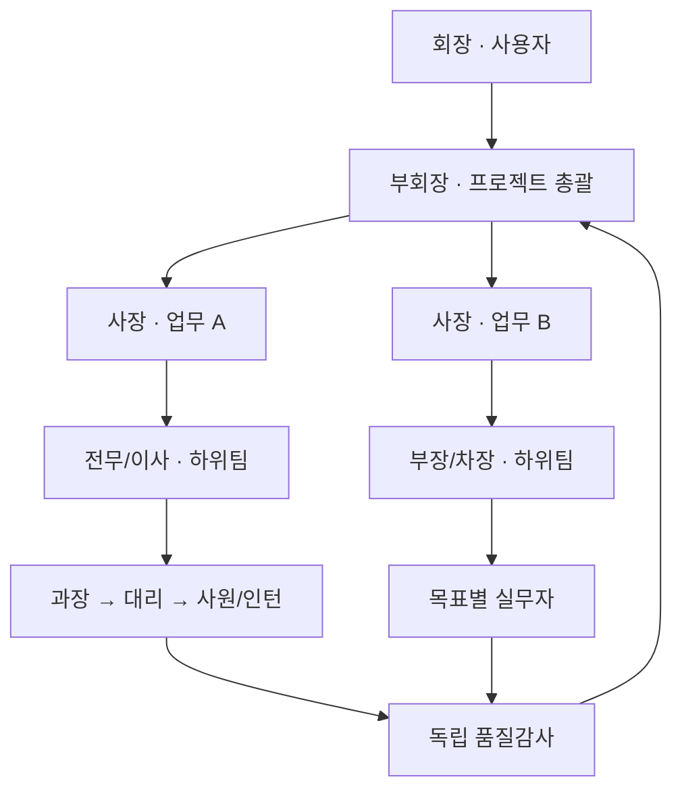
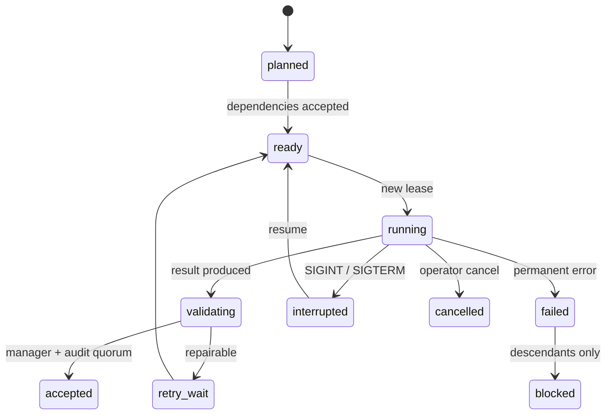

# Luna Swarm

[](https://github.com/jsk1004ha/luna-swarm/actions/workflows/ci.yml?query=branch%3Amain)

ChatGPT 로그인으로 `gpt-5.6-luna`를 사용하는 **수직 조직형 다중 에이전트 오케스트레이터**입니다. 동시 호출 100은 하드 캡이 아닙니다. 기본 상한은 128, 설정 가능 상한은 1,024이며, 처음에는 8개만 실행해 계정과 서버 상태에 맞춰 적응합니다.

핵심은 “같은 질문을 100번”이 아닙니다. 목표를 DAG로 나누고, 서로 다른 책임과 정보 경계를 가진 조직이 기획 → 실행 → 부서 검토 → 독립 감사 → 계층 병합 → 최종 심의를 수행합니다.

## 현재 상태

| 경계 | 현재 검증 상태 |
|---|---|
| `main` CI | Node.js 20.19.0·22.x에서 타입 검사, 전체 테스트, 빌드, production dependency audit, 패키지 검증 통과 |
| Host 도구 | HMAC capability와 durable replay ledger를 사용하는 `read`/`search` 전용 Host Tool Broker가 App Server 호출 경계에 연결됨 |
| 코딩 | opt-in `CodingPipeline`이 Node 22 permission process, disposable clone, protected check, 독립 audit, Single Committer CAS를 실제 Git E2E로 검증함. 일반 Work Order 자동 라우팅은 아직 열지 않음 |
| 평가·배포 | hash-pinned 별도 evaluator process와 protected benchmark runner, signed Shadow/Canary SLO, stable-only 자동 rollback·후보 quarantine·Failure Capsule 경로 구현 |
| 실계정 용량 | 계정 지문·만료·호출·예산 승인에 결박한 1→2→4→8→16→32 shard soak 통과. 64/128/256은 이 호스트에서 실행하지 않았으므로 지원을 주장하지 않음 |
| 출시 판정 | 로컬 코드 병합 준비는 완료했지만, 더 큰 live soak·실제 연구 E2E·장시간 production canary·matched-pair 품질 benchmark가 남아 전체 제품 출시는 **NO-GO** |

정확한 명령, 테스트 수치, live 측정치와 남은 위험은 [구현 감사 보고서](docs/IMPLEMENTATION_AUDIT_2026-08-13.ko.md)에 기록합니다.

## 5분 시작

필요 조건은 Node.js 20.19.x 또는 22.12 이상과 ChatGPT 계정입니다.

```bash
npm ci
npx codex login
npm run build
npm start -- doctor
```

루트의 단일 `package-lock.json`이 서버와 `ui` workspace 의존성을 함께 고정하므로 별도의 UI 설치는 필요하지 않습니다.

먼저 비용 없는 결정론적 모의 실행으로 설치를 확인합니다.

```bash
npm start -- run \
  --goal "이 제품 아이디어의 기술·시장·운영 위험을 분석해 실행안을 만들어라" \
  --mock
```

실제 Luna 실행:

```bash
npm start -- run \
  --goal "이 저장소의 구조를 분석하고 가장 효과가 큰 개선안을 근거와 함께 제시해라" \
  -- --workspace /absolute/path/to/project
```

웹에서 조직의 실행 상태를 관찰하고 지휘하려면 React 운영 콘솔을 엽니다.

```bash
npm start -- ui --workspace . --open

# 모델 호출 없는 30명 시뮬레이션
npm start -- ui --workspace . --mock --open
```

기본 주소는 `http://127.0.0.1:4310`입니다. UI 구조와 시각 기준은 제공된 `luna-swarm-command-center.zip`의 `Home.tsx`와 `index.css`입니다. Luna는 그 단일 workspace shell의 값과 handler만 실제 실행 데이터로 연결하며, 새 기능도 같은 내비게이션·카드·조직도·drawer·directive 문법 안에서 확장합니다. 기존 대시보드 셸을 겹쳐 렌더링하지 않습니다. REST 초기 snapshot 이후 `/api/ui/events` WebSocket에서 실행별 `seq`를 이어받고, 재연결 시 마지막 `seq` 이후 사건을 replay합니다.

`보고서` 화면은 실제 실행의 최종·팀·작업 산출물, Work Order 검증 상태, Council 공개 결정을 회사 문서 레지스트리로 묶어 보여줍니다. 유형·상태·부서·검색 필터와 최신순 정렬, 감사 참조가 포함된 상세 drawer를 제공하며 최대 120개 문서만 유지합니다. 원시 프롬프트, sealed memo, minority report 원문과 비밀 정보는 투영하지 않습니다. 보고서 필드가 없던 이전 snapshot은 빈 문서함으로 안전하게 열립니다.

저장소와 런타임 UI에는 사람 사진이나 캐릭터 sprite 같은 래스터 이미지 에셋을 두지 않습니다. 로고와 summary 장식은 CSS로, 직원은 이니셜·부서색·상태 배지로 표시합니다. REAL 모드의 직원명·이벤트·산출물 소유자는 Work Order에 고정된 `luna-###` agent ID를 동일하게 사용하며, 한국어 합성 이름은 DEMO 모드에서만 사용합니다. 운영 화면은 조직도, Task board, 실행 timeline과 검증 가능한 세부 정보에 집중합니다.

UI 서버가 시작한 실행은 `소유 실행`으로 표시되어 일시정지·재개·전체 취소·동시성 cap·다음 turn 지시·시작 전 작업 우선순위/취소를 제어할 수 있습니다. 별도 CLI에서 시작한 실행은 동일한 상태와 사건을 관찰하되 `외부 실행 · 관찰 전용`으로 표시합니다. 제어 API는 loopback Host/Origin을 확인하며, 비-loopback bind에는 `--token`이 필요합니다.

기존 Canvas 2D 대시보드는 호환 경로로 `npm start -- dashboard --workspace .`에서 계속 실행할 수 있습니다. **회장 명령석**에서는 세 가지 작업을 할 수 있습니다.

- `현재 프로젝트에 지시`: 진행 중인 실행의 append-only 명령 큐에 자연어 지시를 기록합니다. 이미 실행 중인 모델 호출은 바꾸지 않고 다음 planning/DAG/validation/synthesis/judge 체크포인트부터 전 조직에 반영합니다. 브라우저 요청 ID로 재전송을 중복 없이 처리합니다.
- `새 프로젝트 · 실제`: 입력한 목표로 실제 Luna 실행을 시작합니다.
- `새 프로젝트 · 모의`: 모델 호출 없이 전체 회사 흐름을 확인합니다.

종료된 실행에는 새 지시를 넣을 수 없으며, 이미 승인된 결과는 소급해 다시 실행하지 않습니다. 중간에 프로세스를 재개해도 적용된 회장 지시는 유지됩니다.

이 프로젝트는 자식 Codex 프로세스에 운영체제 기본 경로와 `CODEX_HOME`만 allowlist로 전달합니다. API 키, ChatGPT access/refresh token, 클라우드·데이터베이스 자격증명은 전달하지 않으며, `codex login`이 `CODEX_HOME`에 저장한 ChatGPT 인증만 사용합니다.

> 계정 화면의 “무료/무제한” 표시는 ChatGPT 사용 권한을 뜻합니다. 100개 이상의 동시 요청을 서버가 항상 수용하거나 정책이 영구히 유지된다는 보장은 아닙니다. 그래서 숫자를 고정하지 않고 실제 동시성을 자동 조절합니다.

## 목표마다 새로 만드는 수직 조직



사용자는 항상 회장입니다. Architect가 목표의 크기와 종류를 보고 부회장→사장→전무→이사→부장→차장→과장→대리→사원→인턴 중 필요한 직급만 골라 프로젝트 조직을 만듭니다. 작은 작업은 직급을 건너뛰고, 큰 작업은 폭과 깊이를 늘립니다.

각 팀에는 `parentTeamId`, `leadRank`, `leadRole`이, 실무 작업에는 `teamId`, `assigneeRank`, `department`, `ownerRole`이 붙습니다.

- 네 부서장이 서로 보지 않고 독립 기획안을 작성합니다.
- 부회장/수석 아키텍트가 중복과 충돌을 제거하고 하나의 DAG와 조직 트리로 승인합니다.
- 실무 담당은 자기 작업 계약과 이미 승인된 의존 결과만 받습니다.
- 직속 팀장이 결과에 책임을 지고 1차 검토합니다.
- 품질감사팀은 부서장 의견과 다른 감사표를 보지 않고 블라인드 투표합니다. 먼저 결론을 결정할 수 있는 최소 인원만 호출하고, 표가 갈릴 때만 다음 감사자를 순차 투입합니다.
- 직속 팀장 승인 **그리고** 감사 정족수(기본 2/3)가 모두 필요합니다.
- 같은 깊이의 팀장은 병렬로 보고서를 만들고, 상위 팀장은 직속 하위팀의 압축 보고가 모두 도착한 뒤 시작합니다.
- 원본 실무 결과는 계층을 건너뛰지 않습니다. 각 관리자는 직접 보고와 직속 하위팀 보고만 종합합니다.
- 모든 관리 계층은 원본 작업 ID의 정확한 합집합을 보존해야 합니다.
- 독립 final critic이 루트 보고의 요구사항·출처 한계·실패 모드·과도한 확신을 red-team하고 그 표를 최종 심의관에게 전달합니다.
- 최종 심의관이 사용자 요구사항 커버리지를 검사하고, 누락 시 한 번 더 수정을 요구합니다.

기본 역할표와 실행별 동적 조직도 확인:

```bash
npm start -- org
npm start -- org <run-id>
```

전체 직급을 펼친 형태는 [examples/reference-vertical-organization.md](examples/reference-vertical-organization.md)에 있습니다. 각 실행은 `<run>/organization.md`에 실제 생성된 Mermaid 조직도를 남깁니다.

## 왜 SDK 100개가 아닌가

`@openai/codex-sdk`의 각 `thread.run()`은 내부적으로 별도 `codex exec` 프로세스를 실행합니다. 이를 100개 병렬화하면 CLI 프로세스, 메모리, 파일 디스크립터와 ChatGPT 인증 갱신이 동시에 경쟁합니다.

Luna Swarm은 SDK를 모델 실행에 직접 사용하지 않습니다. SDK 패키지에 포함된 공식 Codex 바이너리로 기본 1개, 설정에 따라 여러 개의 **`codex app-server` stdio shard**를 띄웁니다. bounded supervisor가 thread affinity, shard별 inflight/queue, backpressure, circuit breaker와 shutdown drain을 관리하며, 모든 기획자·관리자·실무자·감사자·통합자·심의자 호출은 shard 진입 전에 하나의 전역 동시성 관문을 통과합니다.

## 더 똑똑하게 만드는 장치

| 장치 | 같은 모델에서도 도움이 되는 이유 |
|---|---|
| 역할 헌장 | 임무, 결정권, 보고선과 평가 기준이 달라 동일 답안 복제를 줄임 |
| 정보 격리 | 감사자가 다른 표를 보지 않아 앵커링과 집단사고를 줄임 |
| 다관점 기획 | 전략·조사·기술·레드팀이 각각 누락을 찾은 뒤 통합 |
| 계약형 DAG | 산출물과 합격 기준이 없는 “막연한 하위 작업”을 사전 거부 |
| 이중 게이트 | 직속 팀장 책임 검토와 독립 감사 정족수를 동시에 요구 |
| 동적 수직 보고 | 회장에게 원문 전체를 보내지 않고 직속 보고 단위로 압축 |
| 효율 게이트 | 빈 관리자, 한 명만 거느린 전달용 관리자, 과도한 직속 보고를 사전 거부 |
| 출처 커버리지 | reducer가 작업을 누락하거나 새 출처를 꾸미면 자동 실패 |
| 적응형 동시성 | 안정 시 서서히 확장하고 429 시 한 cooldown epoch에 한 번만 절반으로 감속 |
| 제어 호출 우선 스케줄링 | judge·architect·reducer·검증 호출이 대규모 worker fan-out 뒤에서 굶지 않도록 우선 dispatch하고, aging으로 오래 기다린 작업의 starvation을 방지 |
| 단계적 블라인드 감사 | 정족수가 이미 확정되면 남은 감사 호출을 생략하고, split vote일 때만 추가 감사자를 호출 |
| 양끝 보존 컨텍스트 | 긴 prompt의 목표·요구사항이 있는 앞부분과 최신 feedback이 있는 뒷부분을 함께 보존하고 중간 생략량을 명시 |
| 재개 가능한 lease | 충돌한 늦은 응답은 버리고, 재시작 시 승인 결과는 캐시 |
| 구조화 출력 | 모든 단계가 JSON Schema 계약을 사용해 자유형 응답 드리프트를 억제 |
| 전문 역량 라우팅 | 기획·조사·구현·레드팀·감사·통합·최종심의 호출마다 목적에 맞는 specialist contract를 배정 |
| 필요 시 스킬 로딩 | 내장 runbook과 workspace `SKILL.md` 중 관련성이 높은 최대 3개만 제한된 context로 주입 |
| 이질적 감사 렌즈 | 독립 감사자에게 근거 무결성·완료 기준·실패 모드 렌즈를 서로 다르게 배정 |
| 관찰 전용 경험 ledger | 기존 학습 기록은 `weak_observation`으로만 보존하며 실행 라우팅이나 자동 승격에 사용하지 않음 |
| 고정 실행 Bundle | 실행 시작 시 workload별 Stable Pointer를 snapshot하여 retry·resume 동안 같은 Bundle identity를 유지 |
| 객관적 수동 승격 | L3/L4 Trace·Outcome Receipt에 결합된 paired evaluation만 수동 CAS 승격을 허용하고 rollback 시 실패 Bundle을 격리 |

동일 모델의 판단 오류는 완전히 독립적이지 않습니다. 따라서 코드·계산·DAG·출처 합집합처럼 프로그램으로 검사할 수 있는 것은 다수결보다 결정론적 검사기를 우선합니다.

스케줄러는 전체 cap 불변식을 유지하면서 역할 우선순위와 작업 priority를 함께 사용합니다. 동일 role에서는 기존 작업 priority가 적용되고, 다른 role에서는 worker보다 manager/validator, reducer, architect, judge가 먼저 빈 슬롯을 받습니다. `schedulerAgingMs`마다 오래 기다린 요청의 유효 우선순위를 올려 지속적인 제어 호출에도 실무 작업이 결국 실행되게 합니다. 실행 상태에는 `queueP95Ms`, `maxQueueWaitMs`, `priorityDispatches`, 현재 `threadLocks`가 저장됩니다.

## 명령

```bash
# 환경, ChatGPT 로그인, App Server 쓰기 권한, Luna 카탈로그 확인
npm start -- doctor

# 설정 파일 생성
npm start -- init luna-swarm.config.json

# 새 실행
npm start -- run --goal "..." -- --workspace .

# 실행 목록 또는 상태
npm start -- status
npm start -- status <run-id>

# 로컬 상태 저장소 용량 확인, 무변경 정리 계획, 실제 정리와 복원
npm start -- storage status -- --workspace .
npm start -- storage gc --dry-run -- --workspace .
npm start -- storage gc -- --workspace .
npm start -- storage restore <run-id> -- --workspace .

# 실행별 수직 조직도
npm start -- org <run-id>

# 사용 가능한 내장/workspace 스킬
npm start -- skills -- --workspace .

# 누적된 안전한 학습 메타데이터와 최근 경험
npm start -- learning -- --workspace . --recent

# 레거시 정책 ledger 롤백(런타임 라우팅에는 적용되지 않음)
npm start -- learning -- --workspace . --rollback

# Evolution Harness v2 기준 Bundle 생성 및 현재 상태 확인
npm start -- evolve bootstrap -- --workspace .
npm start -- evolve status -- --workspace .

# 객관적 paired evaluation receipt로 Challenger를 수동 승격
npm start -- evolve promote <bundle-id> -- --workload <class> --expected-generation <n> \
  --evaluation <receipt-id> --evaluation-hash <sha256:...> --actor <name> --reason <text>

# 직전 Stable로 원자 rollback하고 방금 내린 Bundle을 quarantine
npm start -- evolve rollback <workload-class> -- --expected-generation <n> \
  --actor <name> --reason <text>

# 허가된 실제 ChatGPT 계정의 개인정보 비노출 지문 확인
luna-swarm soak account-fingerprint --live-authorized --workspace .

# 지문·만료·호출 수·예산에 결박된 단계별 shard soak
luna-swarm soak --live-authorized --account-email-sha256 <sha256:...> \
  --authorization-expires-at <ISO> --min-stage 1 --max-stage 32 \
  --max-calls 120 --budget-unit request --budget-per-call 1 --budget-limit 120 \
  --workspace .

# Ctrl-C 등으로 중단된 실행 재개
npm start -- resume <run-id> -- --workspace .

# 100명+ 회사형 실시간 대시보드와 회장 명령석
npm start -- dashboard -- --workspace . --port 4310 --open

# React + PixiJS 실시간 운영 콘솔
npm start -- ui --workspace . --port 4310 --open

# 모델을 호출하지 않는 UI 시뮬레이션
npm start -- ui --workspace . --port 4310 --mock --open
```

새 바이너리는 이전 바이너리가 설치한 시스템 기준 Bundle만 현재 소스에 맞는 기준 Bundle로 원자 전진시킵니다. 수동 평가로 승격한 Stable Pointer는 자동으로 덮지 않으며, 이미 실행 중인 run은 시작 시 고정한 Bundle을 계속 사용합니다.

Shadow/Canary 운영 제어 루프는 trusted operations signer가 명시적으로 구성된 경우에만 켜집니다. `LUNA_SWARM_OPERATIONS_SIGNER_KEY_ID`와 `LUNA_SWARM_OPERATIONS_SIGNER_PRIVATE_KEY_FILE` 중 하나만 있거나 둘 다 없으면 후보 트래픽은 열리지 않습니다. 개인키 경로와 원문 계정 식별자는 설정 파일·실행 로그·soak 보고서에 기록하지 마세요.

개발 중에는 빌드 없이 `npm run dev -- <command>`를 사용할 수 있습니다.

`npm` 자체도 `--workspace` 옵션을 사용하므로 npm 11에서는 위 예시처럼 그 앞에 두 번째 `--` 구분자를 둡니다. 빌드된 `luna-swarm` 바이너리를 직접 실행할 때는 추가 구분자가 필요 없습니다.

## 동시성 동작

- `maxConcurrency`는 **동시에 실행 중인 모든 모델 호출의 상한**입니다. planner, 팀장, validator도 예외가 아닙니다.
- 기본 시작값은 8입니다.
- 성공 8회마다 2개 슬롯을 늘립니다.
- 429/usage-limit/server-overload 신호에서는 상한을 절반으로 줄이고 cooldown 동안 새 호출을 멈춥니다.
- 같은 cooldown 구간에 429가 여러 개 도착해도 한 번만 줄입니다.
- 401은 재시도 폭주를 막기 위해 인증 회로를 즉시 엽니다.
- 같은 thread의 turn은 반드시 직렬화됩니다.

100은 더 이상 코드의 하드 캡이 아닙니다. 다만 작은 작업은 3~10개 에이전트가 더 빠르고 정확할 수 있고, `maxAgentTurns`가 runaway 조직 확장을 막습니다.

## 상태와 복구

실행 상태는 기본적으로 다음 위치에 저장됩니다.

```text
<workspace>/.luna-swarm/runs/<run-id>/
  state.json
  events.jsonl
  commands.jsonl
  commands.applied
  commands.closed
  final.md
  organization.md

<workspace>/.luna-swarm/learning/runs/<run-id>.json
<workspace>/.luna-swarm/learning/policy.json
<workspace>/.luna-swarm/archives/runs/<run-id>.luna.gz
<workspace>/.luna-swarm/archives/runs/<run-id>.manifest.json
<workspace>/.luna-swarm/evolution/
  genomes/
  bundles/
  traces/
  outcomes/
  failures/
  evaluations/
  stable-pointers.json
<workspace>/.luna-swarm/skills/<skill-id>/SKILL.md
```

`state.json`은 revision과 SHA-256 checksum을 가진 원자적 snapshot입니다. 임시 파일을 쓴 뒤 fsync와 rename을 사용합니다. 재시작할 때 `running`/`validating` 작업은 새 lease로 되돌리고, 이미 `accepted`인 작업은 다시 실행하지 않습니다.

`commands.jsonl`은 대시보드에서 보낸 회장 지시의 append-only 원본이고, `commands.applied`는 실제 모델 프롬프트에 포함된 지시 ID를 기록합니다. `commands.closed`는 종료 barrier가 명령 접수를 원자적으로 닫는 표식입니다. 명령 append와 종료는 실행별 파일 락으로 직렬화되므로, 종료가 먼저면 API가 지시를 거부하고 명령이 먼저면 마지막 judge가 반드시 읽습니다. 잠금에는 PID·시각·고유 토큰을 기록하며 강제 종료로 남은 잠금만 자동 회수하고 살아 있는 소유자는 시간만으로 탈취하지 않습니다. 쓰다 끊긴 마지막 명령 레코드와 누락된 `directive_queued` 이벤트는 재개 시 원본 로그에서 복구합니다. 웹 서버는 `state.json`을 직접 수정하지 않습니다.

`learning/runs/*.json`은 모델 가중치가 아니라 과거 실행의 작은 로컬 ledger입니다. 원문 목표, 프롬프트, 응답, 코드, URL, 인증정보를 저장하지 않으며 모든 현재·과거 레코드를 `weak_observation`으로 취급합니다. 이 데이터는 진단과 표시에는 남지만 specialist/skill 순위, memory recall, Stable Pointer 승격에는 영향을 주지 않습니다. `learningAutoApply=true`는 설정 검증 단계에서 거부됩니다.

스토리지 유지관리자는 `.luna-swarm`을 hot/cold 계층으로 관리합니다. 기본값은 최근 종료 실행 20개와 7일 이내 실행을 원본 상태로 유지하고, 그보다 오래된 `completed`·`partial`·`failed`·`cancelled` 실행을 한 번에 최대 2개씩 무손실 framed gzip으로 옮깁니다. `planning`·`running`·`reducing`·`judging`·`interrupted` 실행, 활성 lock이 있는 실행, Evolution Objective Outcome이 참조하는 실행은 자동 정리하지 않습니다. Outcome registry가 손상되었거나 파일 경계가 불확실하면 삭제 없이 fail-closed합니다.

아카이브는 파일별 크기·모드·SHA-256 manifest를 가지며, symlink·junction·hardlink·경로 탈출·대소문자 충돌을 거부합니다. 원본은 archive 전체 검증 후 동일 볼륨 quarantine으로 이동하고, 이동된 tree를 다시 검증한 뒤에만 삭제합니다. `storage restore`는 파일을 byte-for-byte 복원하므로 event replay와 Blackboard provenance가 유지됩니다. 자동 유지관리는 실행 lease가 해제된 뒤 bounded pass로 동작해 새 실행 승인을 지연시키지 않으며, `storage gc --dry-run`은 lock이나 디렉터리도 만들지 않습니다. `learning/runs`의 비권위 관찰 record는 `learningHistoryRuns` 개수까지만 유지하지만 Evolution registry·Knowledge Capsule·권위 증거는 의미 요약으로 대체하거나 삭제하지 않습니다.

실행에 영향을 주는 유일한 진화 경로는 `.luna-swarm/evolution`입니다. 새 실행은 workload별 Stable Pointer를 한 번 snapshot하고, 각 Work Order의 retry·validation·resume은 저장된 `bundleId`와 `bundleHash`를 계속 사용합니다. Decision Trace는 원시 채팅 대신 입력·컴포넌트·도구·출력·검증 reference와 실제 측정 가능한 timing만 기록하며 secret·PII·환경변수 값은 제거합니다. Objective Outcome은 원본 Trace와 실제 G0/G2/G3 증거를 역참조하고, paired evaluation 점수는 보호된 benchmark evaluator의 quality receipt까지 검증합니다. Git이 아닌 작업공간은 `sourceIdentity`를 설정할 수 있고, 없으면 본 작업은 관찰 전용으로 계속되지만 승격 근거에는 포함되지 않습니다. 승격은 actor·reason·expected generation·검증 receipt를 모두 요구하는 명시적 `evolve promote`에서만 가능하며, 현재 실행에는 영향을 주지 않고 다음 실행부터 적용됩니다. 자세한 계약은 [Evolution Harness v2](docs/EVOLUTION_HARNESS_V2.ko.md)를 참고하세요.

Workspace 스킬은 `.luna-swarm/skills/<id>/SKILL.md` 또는 `.codex/skills/<id>/SKILL.md`에서 읽습니다. 추가 디렉터리는 `LUNA_SWARM_SKILL_DIRS`에 OS path delimiter로 지정할 수 있습니다. 선언한 role/department가 잘못되면 universal skill로 완화하지 않고 해당 스킬을 거부하며, 정규화한 본문의 SHA-256이 decision identity와 `skills --json`에 포함됩니다. 스킬 본문은 실행하지 않고 프롬프트의 untrusted procedural playbook으로만 넣으며, 역할 헌장·회장 지시·안전 경계·도구 권한·JSON schema를 덮을 수 없습니다.

상태 흐름:



## 주요 설정

| 키 | 기본값 | 의미 |
|---|---:|---|
| `model` | `gpt-5.6-luna` | 모든 조직원이 사용할 모델 |
| `organizationHeadcount` | `auto` | 실행 계획·동시성·검증자 수로 논리 조직 규모를 자동 산정하거나 14~256 사이 정수로 고정 |
| `maxConcurrency` | 128 | 전역 활성 호출 상한; 최대 1,024로 설정 가능 |
| `appServerShardCount` | 1 | 실제 Codex App Server stdio shard 수; 각 shard는 bounded inflight/queue와 thread affinity를 사용 |
| `initialConcurrency` | 8 | 시작 활성 호출 수 |
| `maxTasks` | 512 | architect가 만들 수 있는 DAG 작업 수 |
| `maxTeams` | 256 | 목표별 동적 팀 수 |
| `maxHierarchyDepth` | 12 | 회장 아래 프로젝트 조직의 최대 깊이 |
| `maxDirectReports` | 12 | 한 관리자가 직접 받는 task+child-team 보고 상한 |
| `maxAgentTurns` | 20,000 | 재개를 포함한 실행 전체 모델 turn hard budget |
| `planningCommitteeSize` | 5 | 기획 위원회 최대치. Mission Preflight 기반 topology가 목표 크기 1·3·5를 정하고 설정 상한으로 제한 |
| `validatorsLowRisk` | 2 | 저·중위험 작업의 독립 감사자 수 |
| `validatorsHighRisk` | 3 | 고위험 작업의 독립 감사자 수 |
| `validationQuorum` | 2/3 | 감사 통과 비율; 직속 팀장 승인은 별도 필수 |
| `maxAttempts` | 3 | 작업 재작성 상한 |
| `maxContextChars` | 80,000 | 역할 프롬프트와 회장 지시를 합친 최대 문자 수; 최소 1,024 |
| `callTimeoutMs` | 1,200,000 | 한 모델 호출 제한 시간 |
| `schedulerAgingMs` | 5,000 | 대기 요청을 한 역할 우선순위 단계만큼 승격하는 주기 |
| `allowNetwork` | false | read-only agent의 네트워크 사용(명시적 opt-in) |
| `ephemeralThreads` | true | 내부 App Server thread를 Codex 대화 기록에 영구 저장하지 않음. 디버깅용 기록이 필요할 때만 `false`로 opt-in |
| `harnessEnabled` | true | 전문 역량 라우팅과 bounded skill prompt 사용 |
| `maxSkillsPerCall` | 3 | 한 호출에 선택하는 스킬 상한 |
| `maxSkillChars` | 6,000 | 선택 스킬 metadata를 우선 보존하고 instruction을 공평하게 나누는 전체 문자 예산 |
| `learningEnabled` | true | 검증된 실행 경험의 workspace 로컬 기록 |
| `learningAutoApply` | false | Evolution Harness v2에서 비활성. 학습 기록은 관찰 전용이며 Bundle 승격은 수동 CAS만 허용 |
| `sourceIdentity` | 생략 | 비Git 배포의 구체적인 빌드 identity. 없으면 본 작업은 계속하되 해당 run은 승격 증거에서 제외 |
| `evolutionBenchmarkAuthorities` | `{}` | 보호된 benchmark evaluator의 공개키·버전·suite hash allowlist. 개인키 저장 금지 |
| `maxMemoriesPerCall` | 4 | 한 호출에 회수하는 과거 경험 상한 |
| `maxMemoryChars` | 3,000 | 경험 회수 블록 문자 예산 |
| `learningHistoryRuns` | 200 | 시작 시 읽는 과거 실행 record 상한 |
| `storageMaintenance` | 자동, 5 GiB | 무손실 cold archive, 보존 기간·최근 실행 수·pass당 처리량·복원 안전 상한을 묶은 로컬 저장소 정책 |
| `learningMinSamples` | 3 | 관측 성과를 스킬 순위에 반영하기 위한 최소 표본 |

예시는 [examples/luna-swarm.config.json](examples/luna-swarm.config.json)에 있습니다.

## 안전 범위

- 모든 에이전트 sandbox는 기본적으로 `read-only`, approval policy는 `never`입니다.
- 여러 에이전트가 같은 저장소를 동시에 수정하지 않습니다. 코드 작업도 우선 분석·설계·패치 제안으로 반환합니다.
- 이벤트 로그에는 프롬프트, 답변, 토큰이나 인증정보 대신 역할·상태·동시성 같은 metadata만 기록합니다.
- 로컬 학습 record에도 원문 목표·프롬프트·응답을 저장하지 않습니다. 자동 적응은 specialist/skill 선택 순위와 검증 절차 힌트에만 영향을 주며 권한, sandbox, 외부 발신, 파괴적 작업 정책은 바꾸지 못합니다.
- 명령이 활성화된 대시보드는 loopback에만 bind하고 Host/Origin을 검증합니다. 회장 명령은 안전한 실행 ID의 실행별 큐에만 append하며 checksummed snapshot을 직접 수정하지 않습니다.
- 저장소나 웹 문서는 신뢰할 수 없는 증거로 취급하며, 조직 역할 헌장을 덮어쓰는 지시로 취급하지 않습니다.
- `CODEX_HOME`은 App Server가 SQLite 상태를 만들 수 있도록 쓰기 가능해야 합니다. `doctor`가 이를 확인합니다.

일반 Swarm 실행은 계속 read-only입니다. Host Tool Broker도 `read`/`search`만 허용하고, HMAC capability, durable replay/idempotency ledger, canonical path scope, credential/state deny scope, 서명 receipt를 매 호출에 강제합니다. 파일을 쓰는 코딩은 별도의 opt-in `CodingPipeline`에서만 실행됩니다. 이 경로는 hash-pinned 프로세스 executor, disposable Git clone, bounded snapshot, 보호된 check와 독립 audit receipt, plumbing-only commit 생성, target-ref CAS, Single Committer를 하나의 트랜잭션 경계로 묶습니다.

## Harness v2

실행 계획은 고유 이름을 가진 가변형 Harness v2 조직의 revisioned Work Order로 투영됩니다. 기본 `auto` 모드는 계획의 작업 수·동시성·검증자 수에 맞춰 14~256명의 논리 조직을 산정하며, 산정된 roster는 실행에 고정되어 재시도·재개에도 같은 직원 배정을 보존합니다. `lab-128@2`는 기존 실행 호환을 위해 유지한 조직 계약 버전 이름이며 인원 제한을 뜻하지 않습니다. 계획 전 Mission Preflight가 숨은 가정과 경계 위험을 구조화하고, deterministic topology router가 `single`·`centralized`·`parallel-research`·`review-loop` 중 하나를 선택합니다. 순차 코딩은 planner 1명과 독립 검증 loop를 우선하고, 서로 독립적인 조사만 제한적으로 fan-out합니다. bounded AST 기반 Program Knowledge Graph는 각 Work Order에 필요한 코드 관계만 Context Compiler에 공급하며, compiler가 whole item으로 승인한 mission·Work Order·dependency frame은 최종 prompt 조립에서도 절단되지 않습니다. Oracle Forge는 실행 전에 평가 기준을 봉인하고 제출된 artifact hash를 별도 evaluator가 재평가해 G2 receipt를 만들며, 고위험 작업은 Experiment Fabric에 metric·seed·stopping rule을 사전등록합니다. 작업 결과, 실제 envelope 검사, Oracle 평가, run-pinned reviewer slot의 manager/auditor vote, G0/G2/G3 receipt는 immutable Blackboard CAS에 저장됩니다. 실행에서 얻은 지식은 candidate capsule로만 남고, trusted verifier가 evidence와 recipe를 재검증한 capsule만 다음 컨텍스트에 회상됩니다. Dashboard는 사전등록·후보·검증 완료를 서로 다른 상태로 표시합니다. 설계 근거와 acceptance test는 [실행 품질 최적화 문서](docs/HARNESS_OPTIMIZATION_2026-08-17.ko.md)에 정리했습니다.

실제 쓰기·shell·network Tool Broker, arbitrary experiment runner, 모든 Evolution component loader는 아직 구현됐다고 주장하지 않습니다. 보호된 평가는 별도 hash-pinned evaluator 프로세스가 hidden suite와 개인키를 소유하고, allowlist된 benchmark runner의 전체 실행 closure를 private copy에서 실행해 서명 receipt만 반환합니다. Shadow/Canary는 operator approval과 operations signer가 구성된 경우에만 후보 트래픽을 열며, signed SLO 위반은 stable-only 전환, 후보 quarantine, Failure Capsule을 durable exactly-once 경로로 연결합니다. App Server는 bounded multi-shard supervisor를 사용하지만 이 저장소에서 실제 계정 검증을 완료한 상한과 미검증 상한은 아래 배포 경계에 구분해 기록합니다.

## 개발 및 검증

의존성은 저장소 루트에서 한 번 설치합니다.

```bash
npm ci
```

```bash
npm run check
npm test
npm run build
```

### 실패 진단과 재실행

- `node dist/src/cli.js ...`로 실행할 때는 소스 수정 뒤 `npm run build`로 `dist`를 갱신해야 합니다. 이미 `failed`로 종료된 실행은 증거 원장을 덮어쓰지 않으므로, 새 빌드로 UI 서버를 다시 시작한 뒤 새 실행을 생성합니다.
- Mission Preflight의 구조화 응답이 계약을 어기면 한 번의 제한된 교정 호출을 수행하고, 그래도 실패하면 잘못된 필드 경로를 그대로 표시합니다.
- 기본 G2 산출물 Oracle은 하나의 계약 문구가 여러 실제 산출물 항목으로 구체화될 수 있음을 인정하되, 계약의 모든 의미 토큰이 실제 항목 전체에 구조적으로 나타나야 통과합니다. 기존 사용자 정의 `deliverable-present` Oracle의 exact-match 의미는 유지됩니다.
- 라틴 계약 토큰 뒤의 제한된 한국어 조사·서술형 접미사는 의미가 같은 형태로 정규화합니다. 예를 들어 `verified의`, `verified이며`는 `verified` 계약을 충족하지만 `unverified의`, `verified의미`, `verified의도` 같은 부분 문자열은 통과하지 않습니다.
- rework가 필요하면 이전 revision의 산출물 reference와 content hash, 제한된 결과 excerpt, manager/auditor 피드백, 실패한 Oracle case와 Gate reference를 다음 worker의 필수 context frame에 넣습니다. 생략된 문자·항목 수도 기록하므로 큰 1차 결과가 2차 호출의 context를 고갈시키지 않으면서 모델은 정확한 실패 delta를 수정할 수 있습니다.
- 모든 작업이 거절되면 `No task result passed validation`만 출력하지 않고, 실패한 작업과 실제 validator/Gate/Council 사유를 최대 3건까지 최종 오류와 `run_failed` 이벤트에 포함합니다. 재시도 한도가 끝난 작업은 `task_rework`가 아니라 `task_failed`로 기록됩니다.
- Host Tool 세션이 없는 App Server 호출에는 도구를 호출하지 말라는 명시적 지시를 넣습니다. App Server shard는 Luna의 자체 SkillCatalog와 read/search Host Tool Broker만 사용하므로 Codex plugin·remote plugin·skill search·system-skill dependency 설치를 시작부터 비활성화합니다. App Server `dynamicTools`의 전송 기반인 `code_mode_host`만 명시적으로 켜고, 모델이 작성한 코드를 실행하는 `code_mode`, shell, browser, app 도구는 계속 끕니다. Host Tool 오류를 정상 로그처럼 숨기지 않으며 인증·rate limit·transport 오류와 함께 운영 stderr에 보존합니다.
- 모든 계획 task는 자유형 `kind`와 별개로 폐쇄형 `executionMode`를 선택해야 하며, `requiredCapabilities`는 그 모드의 고정 집합과 정확히 일치해야 합니다. 호스트는 구현·명령 검증·외부 조사 의미가 있는 objective/deliverable이 더 약한 모드를 선택하면 계획을 거부합니다. Work Order 도구 정책도 모델의 자유 선언이 아니라 이 모드에서 파생됩니다. REAL read-only 실행은 신규 계획과 resume 모두에서 외부 웹 조사, workspace 쓰기, 명령 실행 요구를 Work Order 생성·실행 전에 `RUNTIME_CAPABILITY_MISMATCH`로 중단하고 해당 task/capability를 표시합니다. 안전 경계 밖의 일을 수행했다고 가장하며 수십 회 호출한 뒤 연쇄 실패하지 않습니다. 이런 목표는 별도의 opt-in CodingPipeline 또는 향후 host-mediated network broker에 명시적으로 연결해야 합니다.
- reducer가 exact union을 다시 타이핑하도록 맡기지 않습니다. claims·conflicts·gaps·recommendations·sourceTaskIds·immutable lineage는 orchestrator가 accepted input에서 결정론적으로 만들고, reducer 호출 실패 시에도 같은 provenance packet을 생성합니다. 일부 작업만 성공한 실행은 성공 근거를 잃고 `No accepted direct work`로 바뀌지 않으며, 최종 coverage gate가 실제 미충족 요구사항을 보고합니다.
- 내부 planner/worker/validator 호출은 기본적으로 ephemeral thread를 사용하고 `luna-swarm-internal` source로 태깅하므로 Codex의 우선순위·최근 대화 목록에 실행 수만큼 쌓이지 않습니다. 프로세스 안에서는 같은 논리 `threadKey`를 계속 재사용하며, 장애 재개에 필요한 권위 상태는 Codex 대화 기록이 아니라 Luna의 checksummed run state와 Blackboard에 보존됩니다. 과거처럼 내부 대화를 Codex 기록에 남겨 디버깅하려면 설정에서 `ephemeralThreads: false`를 명시합니다.

GitHub Actions는 Node.js 20.19.0과 22.x에서 clean install, 타입 검사, 전체 테스트, 빌드, production dependency audit와 package dry-run을 실행합니다.

UI만 개발할 때는 터미널 두 개에서 서버와 Vite를 나눠 실행할 수 있습니다.

```bash
npm run ui -- --workspace . --mock --port 4310
npm run dev:ui
```

Vite 개발 서버는 `http://127.0.0.1:4311`에서 `/api`와 WebSocket을 4310으로 프록시합니다. 프로덕션 UI는 `ui/dist`에 빌드되어 `npm start -- ui`가 같은 origin에서 제공합니다.

테스트는 네트워크와 실제 모델 호출 없이 다음을 검증합니다.

- DAG cycle/missing dependency/self dependency 거부
- 실패한 가지의 후손만 block
- 256개 논리 호출에서 cap 1/4/16/100/128/256 준수
- 동시 429의 epoch당 한 번 감속
- transient retry, auth circuit breaker, abort no-retry
- 직속 팀장 게이트와 블라인드 2/3 감사 정족수
- 목표별 직급/팀 트리, 깊이별 병렬 보고, 전 계층 출처 보존
- crash/resume에서 accepted cache와 orphan lease 교체
- checksum을 가진 원자적 상태 저장
- 종료 실행의 무손실 gzip cold archive, dry-run, 명시적 복원, outcome 참조 보호와 run ID 충돌 방지
- 144명 데모/실행 snapshot/SSE/정적 파일 경계와 path traversal 차단
- 진행 중 회장 지시의 큐 저장, 안전 체크포인트 반영, 비소급 실행, 재개 시 중복 방지
- workspace 스킬 발견·역할/부서/작업 유형 라우팅·context 상한
- 실행 경험의 원문 비저장과 관찰 전용 기록, 독립 평가를 통과해 수동 승격된 Bundle만 다음 실행의 routing/prompt에 반영
- UI 이벤트 Zod 검증, 실행별 seq 중복 제거와 WebSocket replay
- durable pause/resume/cancel/concurrency와 다음 turn `OperatorInstruction` 주입
- 실행별 가변 roster 좌석·동서남북 착석·A* 경로·tile reservation·고밀도 조직 표시 정책
- 진행률-only snapshot의 Pixi 장면 재생성 방지, 정적 회사 레이어 1회 mount, 에셋 없는 도형 마커의 안정적 변형
- 10,000건 사건 가상 목록과 외부 실행 관찰 전용 제어 거부

현재 제한사항: 브라우저는 한 서버 프로세스가 동시에 소유한 실행 하나만 직접 제어합니다. 257명 이상은 지도에서 전원을 동시에 그리지 않고 부서/층 집계와 검색으로 접근합니다. 취소는 진행 중 모델 호출에 AbortSignal을 전달하지만 이미 승인된 결과를 삭제하거나 재실행하지 않습니다. React/Pixi 운영 UI의 직원 표시는 사람 이미지 에셋에 의존하지 않습니다.

### 검증 상태와 배포 경계

- 자동 테스트와 deterministic E2E는 mock backend 또는 로컬 fake App Server 프로세스를 사용합니다. 별도로 명시적 계정 지문·만료·호출·예산 승인을 적용한 실제 ChatGPT 계정 shard soak는 1→2→4→8→16→32 단계까지 통과했습니다. 원문 계정 식별자와 인증정보는 보고서에 저장하지 않습니다.
- 논리 조직은 14~256명으로 산정할 수 있고 실제 호출 동시성과 분리됩니다. 이 호스트에서는 지연과 메모리 headroom을 근거로 64/128/256 live 단계를 실행하지 않았으므로 해당 용량을 주장하지 않습니다.
- read/search Host Tool Broker, 프로세스 격리 코딩 pipeline + Single Committer E2E, 별도 protected evaluator process, durable Shadow/Canary 자동 rollback control loop가 구현되어 있습니다. 코딩은 기본 Swarm write 권한이 아니며, 배포 후보 트래픽은 trusted signer 설정이 없으면 fail-closed입니다.
- 실제 연구 원출처 E2E와 강한 단일 모델·기존 Champion·새 Challenger의 matched-pair 품질 비교는 수행하지 않았으므로 품질 우수성을 주장하지 않습니다.

더 자세한 설계와 불변식은 [docs/ARCHITECTURE.ko.md](docs/ARCHITECTURE.ko.md)를 참고하세요.

현재 구현 범위와 출시 판정은 [2026-08-13 구현 감사 보고서](docs/IMPLEMENTATION_AUDIT_2026-08-13.ko.md)에 기록했습니다.

## 공식 참고 문서

- [Codex 인증](https://learn.chatgpt.com/docs/auth)
- [Codex SDK](https://learn.chatgpt.com/docs/codex-sdk)
- [Codex App Server](https://learn.chatgpt.com/docs/app-server)
- [Non-interactive mode](https://learn.chatgpt.com/docs/non-interactive-mode)
- [Codex subagents](https://learn.chatgpt.com/docs/agent-configuration/subagents)
- [Hermes Agent persistent memory](https://hermes-agent.nousresearch.com/docs/user-guide/features/memory/)
- [Hermes Agent skills](https://hermes-agent.nousresearch.com/docs/user-guide/features/skills)
- [Pixel Agents](https://github.com/pixel-agents-hq/pixel-agents)

## 라이선스

MIT
