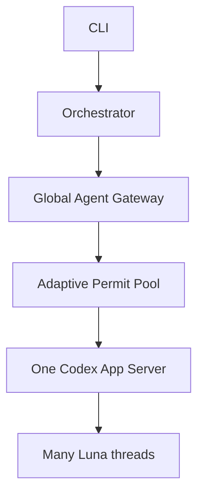
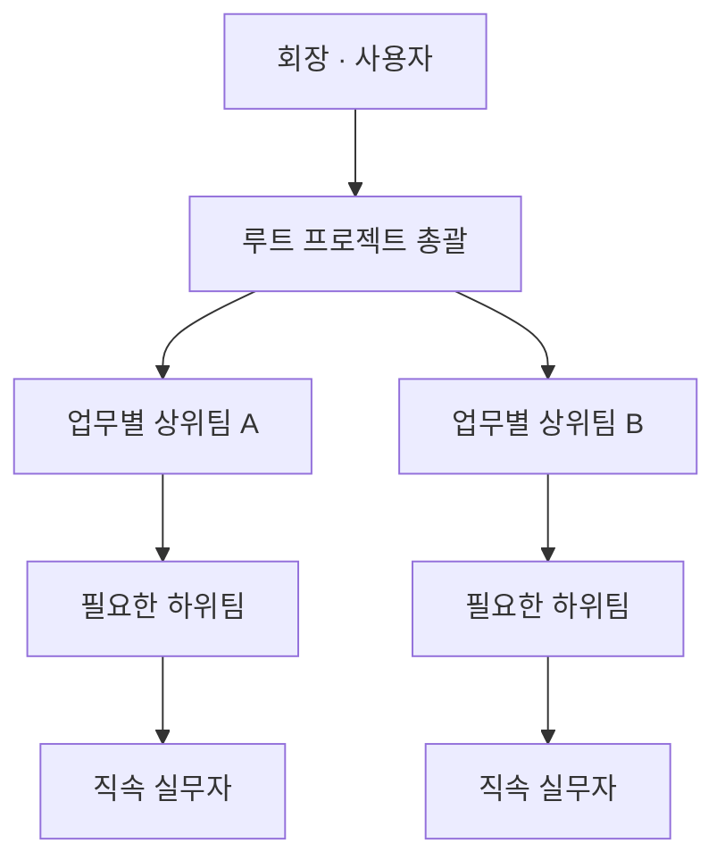
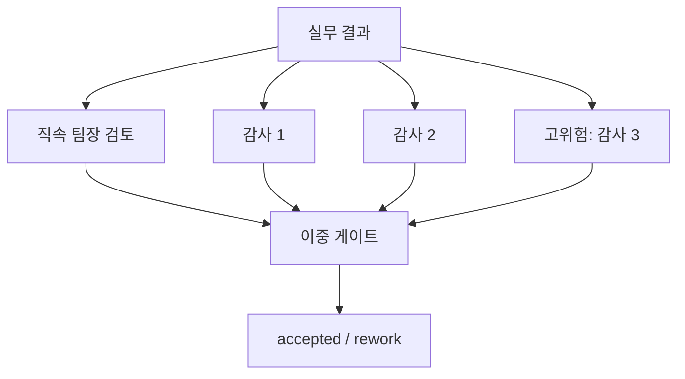
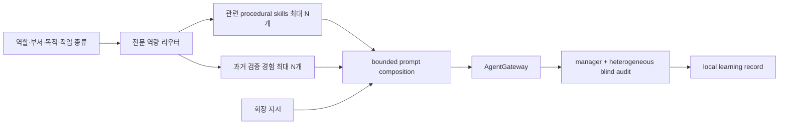

# Luna Swarm 아키텍처

## 목표

Luna Swarm의 목표는 “100번을 무조건 동시에 호출”이 아니라, 필요하면 100을 넘기면서도 다음 조건을 함께 만족하는 것입니다.

1. 독립 작업은 실제로 병렬화한다.
2. 같은 모델의 상관 오류를 역할·정보·검증 구조로 줄인다.
3. 과부하, 취소, 프로세스 중단 후에도 승인된 결과를 잃지 않는다.

## 런타임 경계



모델을 부르는 모든 경로는 `AgentGateway` 한 곳을 통과합니다. 기획·직속 팀장 검토·감사·수직 보고·최종 심의 역시 같은 전역 permit을 소비하므로 숨은 `Promise.all`이 상한을 우회하지 못합니다.

App Server는 JSONL stdio로 통신합니다. 클라이언트는 `initialize` → `initialized`를 수행하고, 역할 인스턴스마다 `thread/start` 또는 `thread/resume`, 작업마다 `turn/start`를 보냅니다. `item/completed`의 마지막 agent message와 `turn/completed` 상태가 모두 정상이어야 호출 성공으로 취급합니다.

## 목표별 수직 조직

사용자는 회장입니다. Architect는 목표마다 다음 직급 사다리에서 필요한 단계만 사용합니다.

```text
회장(사용자) → 부회장 → 사장 → 전무 → 이사 → 부장 → 차장 → 과장 → 대리 → 사원 → 인턴
```

작은 작업은 직급을 건너뛰고, 복잡한 작업만 폭과 깊이를 늘립니다. 프로그램은 빈 관리자, 직접 작업 없이 하위팀 하나만 통과시키는 관리자, 설정된 `maxDirectReports`를 넘는 관리자를 거부합니다.



| 노드 | 보는 정보 | 위로 보내는 정보 |
|---|---|---|
| 실무자 | 자기 계약과 accepted dependency | 구조화된 작업 결과 |
| 직속 팀장 | 직접 소속 실무 결과 + 직속 하위팀 보고 | 하나의 provenance 보존 보고서 |
| 상위 팀장 | 직속 보고만 | 한 단계 더 압축한 보고서 |
| 품질감사 | 작업 계약과 제출 결과 | blind accept/revise/reject |
| 최종 심의관 | 루트 보고와 요구사항 | 사용자용 최종 결과 |

같은 깊이의 팀장은 병렬로 종합합니다. 부모 팀장은 모든 직속 하위팀 보고가 끝난 다음 시작하므로 원본 leaf가 계층을 건너뛰지 않습니다. 같은 Luna 모델을 사용하더라도 각 thread에는 다른 역할 헌장과 정보 경계가 주어집니다. 단, 이는 진짜 모델 다양성을 만들지는 않으므로 가능한 검사는 코드로 수행합니다.

## 계획 계약

Architect가 승인할 핵심 계약:

```ts
interface TeamSpec {
  id: string;
  name: string;
  mission: string;
  parentTeamId: string | null;
  leadRank: CorporateRank;
  leadRole: string;
  synthesisCriteria: string[];
}

interface TaskSpec {
  id: string;
  title: string;
  objective: string;
  kind: string;
  department: "strategy" | "research" | "engineering" | "risk";
  ownerRole: string;
  teamId: string;
  assigneeRank: CorporateRank;
  dependencies: string[];
  requirementIds: string[];
  deliverable: string;
  acceptanceCriteria: string[];
  risk: "low" | "medium" | "high";
  priority: number;
  depth: number;
  maxAttempts: number;
}
```

모델 출력 후 프로그램이 다시 검사합니다.

- task/requirement ID 중복 금지
- 없는 dependency와 requirement 참조 금지
- self dependency와 cycle 금지
- team parent cycle, missing parent, 복수 root 금지
- 부모보다 높거나 같은 child lead rank 금지
- 팀장보다 높거나 같은 task assignee rank 금지
- 빈 팀, 한-child 전달 전용 관리자, 과도한 direct reports 금지
- department와 ownerRole의 조직표 일치
- 산출물과 합격 기준 필수
- `maxTasks`, `maxAttempts` hard budget 적용
- depth는 모델 값을 믿지 않고 DAG에서 다시 계산

## 작업 승인



감사자들은 서로의 표를 볼 수 없습니다. 기본 통과식은 다음과 같습니다.

\[
\text{accepted} = \text{managerAccept} \land
\left(\text{auditAccepts} \ge \left\lceil V \times \frac{2}{3} \right\rceil\right)
\]

기술 오류나 timeout은 찬반 표가 아니라 abstain입니다. 중복 validator ID는 한 표만 집계합니다.

감사 호출은 단계적입니다. 기본 고위험 설정 `V=3`, 정족수 `2/3`에서는 manager와 첫 두 blind auditor를 실행합니다. 두 표가 모두 accept이면 세 번째 호출 없이 정족수가 확정되고, split vote이면 세 번째 감사자를 호출합니다. 반대로 남은 표로 결론을 뒤집을 수 없을 때도 조기 종료합니다. 호출하지 않은 감사자는 투표로 기록하지 않으며, `audit_early_stopped` 또는 `audit_escalated` 사건으로 결정 경로를 남깁니다.

## 수직 보고와 계층 병합

Leaf 팀장은 자기 팀의 accepted 작업 결과만 받습니다. 그 위 팀장은 자기 직속 작업과 직속 child-team의 압축 packet만 받습니다. 같은 depth의 팀들은 병렬 실행되고, depth가 한 단계 올라갈 때 barrier가 생깁니다.

각 팀 보고의 `sourceTaskIds`가 입력 packet들의 정확한 합집합과 다르면 repair를 한 번 요구하고, 다시 틀리면 해당 팀 보고를 실패시킵니다. 루트 보고는 전체 accepted task ID의 정확한 집합과 다시 비교됩니다. 따라서 관리 계층 어느 곳에서도 조용한 정보 누락이 허용되지 않습니다.

팀별 direct report 수가 제한되므로 100개가 넘는 leaf가 있어도 한 모델이 모든 긴 원문을 한 번에 소화하지 않습니다.

Final judge 전에 독립 `failure-mode-critic`이 루트 synthesis만 보고 요구사항·출처 한계·실패 모드·과도한 확신을 구조화된 표로 red-team합니다. Judge는 이 표의 material issue를 답에서 해결하거나 caveat로 보존해야 합니다. Final judge에도 같은 provenance gate와 requirement ID의 정확한 집합 검사를 적용합니다.

## 적응형 실행 하네스

모든 모델 호출은 `callAndRemember()`에서 하나의 하네스 조립 경계를 통과합니다.



전문 역할은 조직 직책과 별도입니다. 예를 들어 한 작업의 조직 역할은 `research_specialist`, runtime 역할은 `worker`, 전문 역량은 `research-investigator`일 수 있습니다. Planner는 요구사항·critical path·adversarial·operations·simplicity 렌즈를, blind validator는 근거 무결성·완료 기준·실패 모드 렌즈를 번갈아 사용합니다. 모델은 같아도 목표 함수와 검사 관점의 상관을 낮추려는 장치이며, 진짜 모델 다양성을 주장하지 않습니다.

스킬 카탈로그는 내장 runbook과 workspace `SKILL.md`를 합칩니다. 파일 크기·개수·ID·제어문자를 제한하고 역할/부서/작업 유형·텍스트 관련성으로 점수를 계산해 최대 `maxSkillsPerCall`개만 읽습니다. 스킬은 untrusted procedural playbook으로 표시되므로 역할 헌장, 회장 지시, sandbox, tool permission, JSON schema보다 우선할 수 없습니다.

Prompt budget 우선순위는 다음과 같습니다.

1. 회장 지시는 마지막 블록으로 반드시 보존한다.
2. 본래 task contract를 위한 최소 context를 남긴다.
3. 남은 범위 안에서 specialist/skill/experience 블록을 자른다.
4. 전체 길이는 항상 `maxContextChars` 이하이다.

## 관찰 전용 레거시 학습과 Evolution Harness v2

여기서 학습은 모델 파라미터 업데이트가 아닙니다. 기존 learning ledger는 진단을 위한 약한 관찰 데이터이며 실행 routing이나 자동 승격에 사용하지 않습니다. 운영 설정에서 `learningAutoApply=true`는 거부됩니다.

```text
durable run state/events
  → workload별 Stable Bundle snapshot
  → immutable Decision Trace
  → Trace에 결합된 L3/L4 Objective Outcome Receipt
  → 동일 case/environment/budget의 paired evaluation
  → operator-only generation-CAS promotion
  → 다음 run부터 새 Stable 사용
  → 이상 시 이전 Stable rollback + 실패 Bundle quarantine
```

- 저장: task kind, 부서, 위험도, 시도 수, manager/감사 결과, specialist/skill/memory ID, 고정된 품질 신호
- 비저장: 원문 목표, 프롬프트, 응답, 코드, URL, credential, chain-of-thought
- positive memory: accepted 결과가 몇 번의 시도와 어떤 감사 합의로 통과했는지에 대한 일반화된 절차 교훈
- negative memory: 실패 내용 자체가 아니라 더 이른 반증·증거 확인·escalation이 필요했다는 고정된 경고
- 적용: 레거시 경험과 `policy.json`은 관찰·감사 전용이며 실행 skill 순위를 바꾸지 않음
- 승격: L3/L4 Outcome Receipt에 결합된 paired evaluation이 hard gate·비회귀·최소 개선 조건을 통과한 경우에만 operator가 수동 승격
- 드리프트 방지: run 시작의 workload별 Bundle snapshot은 실행 중 바뀌지 않으며 새 Stable은 다음 run부터 사용
- rollback: expected generation을 요구하는 CAS로 이전 Stable을 복구하고 내려간 Bundle은 quarantine하여 자동 재승격을 차단

레거시 학습 쓰기 실패는 본 업무의 완료 상태를 실패로 바꾸지 않고 `learning_failed` advisory event로 남깁니다. 반면 새 run의 Bundle pin 무결성, Trace/Outcome identity, 승격 receipt 검증은 실행·승격의 fail-closed 경계입니다.

## 적응형 동시성

초깃값 \(C_0=8\), 기본 최댓값 \(C_{max}=128\)입니다. 설정으로 1,024까지 올릴 수 있습니다.

- 안정적인 성공 8회: \(C \leftarrow \min(C+2, C_{max})\)
- rate limit: \(C \leftarrow \max(C_{min}, \lfloor C/2 \rfloor)\)
- rate limit cooldown 동안 신규 launch 0
- 같은 cooldown epoch의 동시 rate limit은 감축 1회
- cap 하향 시 이미 실행 중인 turn은 중단하지 않고, active가 새 cap 아래가 될 때까지 새 turn을 시작하지 않음

Permit 대기열은 FIFO가 아니라 안정적인 우선순위 큐입니다.

```text
judge > architect > reducer > manager/validator > planner > worker
동일 역할: task priority 우선
장기 대기: schedulerAgingMs마다 한 role band만큼 승격
```

이 방식은 이미 실행 중인 worker를 선점하지 않습니다. 다음 permit이 비는 순간 제어·검증 호출을 먼저 시작해 worker fan-out이 최종 심의나 승인 전파를 굶기는 현상을 줄입니다. 같은 우선순위는 enqueue 순서를 보존합니다. 대기열은 최근 1,024건의 표본으로 `queueP95Ms`를 계산하고 최대 대기시간·우선 dispatch 횟수와 함께 상태에 기록합니다. 완료된 keyed thread mutex는 사용자 수가 0이 되는 즉시 map에서 제거합니다.

429의 `Retry-After`가 메시지에 있으면 cooldown의 하한으로 사용합니다. 401은 retry하지 않고 auth circuit을 엽니다.

## 컨텍스트 경계

문자 예산 자체는 기존 설정과 호환되도록 유지하지만, 초과 prompt를 더 이상 prefix-only로 자르지 않습니다. 60%는 목표·요구사항·작업 계약이 있는 앞부분에, 나머지는 최신 feedback·검증 오류가 있는 뒷부분에 배정하고 중간 생략량을 marker로 기록합니다. UTF-16 surrogate 경계도 보정합니다. 회장 지시와 하네스 블록을 붙일 때 재절단되더라도 같은 양끝 보존 규칙을 사용합니다.

완전한 token-aware evidence packer, 역할별 hard lane reservation, WAL/checkpoint compaction, 동적 DAG 증원은 후속 단계입니다. 현재 변경은 기존 상태 포맷·global cap·accepted 불변식·resume 계약을 유지하는 범위에 한정합니다.

## 상태 불변식

1. 모든 dependency가 `accepted`일 때만 task를 시작한다.
2. planner/manager/worker/validator/reducer/judge를 합친 active call 수가 global cap을 넘지 않는다.
3. 일반 실패의 `attempts <= maxAttempts`를 유지한다. 취소된 read-only 시도는 resume 시 attempt를 돌려준다.
4. `accepted` 결과는 불변이다.
5. 현재 `leaseId`와 다른 늦은 결과는 폐기한다.
6. 상태 revision은 단조 증가한다.
7. required 작업과 final coverage gate가 충족돼야 `completed`다. 일부 독립 작업만 성공하면 `partial`이다.
8. 부모 팀장은 직속 child team이 terminal report를 만든 뒤에만 시작한다.
9. root `sourceTaskIds`는 accepted task ID의 정확한 집합이다.

## 저장과 복구

Snapshot envelope:

```json
{
  "schemaVersion": 1,
  "revision": 42,
  "checksum": "sha256-of-state",
  "state": {}
}
```

저장 순서는 unique temp write → file datasync → atomic rename → 가능한 환경에서 directory fsync입니다. 손상되거나 schema가 다른 파일을 조용히 덮어쓰지 않습니다.

재개 시:

- `accepted`: 캐시, 재실행 금지
- `running`/`validating`: orphan으로 보고 새 lease의 `ready`
- `cancelled`: `ready`로 복구
- 과거 lease의 늦은 완료: 무시

## 호출 수 예산

Task 수 \(T\), 동적 관리팀 수 \(M\), 평균 감사자 수 \(V\), 평균 실행 시도 수 \(A\)라면 모델 turn 수의 거친 하한은 다음과 같습니다.

\[
5\text{ planners} + 1\text{ architect} + T \times A \times (1\text{ worker}+1\text{ manager}+V\text{ auditors}) + M\text{ upward reports} + 1\text{ final critic} + judge
\]

따라서 task 수는 agent turn 수와 다릅니다. `maxConcurrency`는 이 모든 turn을 합친 **동시 활성 상한**이고, `maxAgentTurns`는 재개를 포함한 전체 실행의 hard budget입니다.

## 현재 한계와 다음 지능 개선

현재 구현:

- 목표별 동적 직급/팀 트리와 정보 격리
- 다관점 계획과 deterministic DAG gate
- manager + blind audit 이중 게이트
- 깊이별 병렬 수직 보고와 전 계층 provenance/coverage gate
- 429 적응, auth circuit, timeout, retry
- atomic snapshot과 lease 기반 resume
- 목적별 specialist routing, 필요 시 skill 로딩, 이질적 validator lens
- 검증 신호만 저장하는 cross-run local learning과 bounded recall

다음 단계로 효과가 큰 개선:

1. 작업 종류별 결정론적 도구: 코드에는 test/lint, 계산에는 별도 evaluator, URL에는 실제 source fetch를 붙여 감사표보다 우선합니다.
2. holdout evaluator와 strategy version: 관측된 routing 개선안을 별도 과제에서 baseline과 비교하고 승인/rollback합니다.
3. 결과 fingerprint와 evidence graph: 표현만 다른 중복 작업을 합치고 동일 원출처에서 나온 “가짜 다수결”을 감지합니다.
4. 불확실성 기반 인력 증원: 영향도·불확실성·비가역성이 높은 노드에만 감사자와 반례 탐색자를 추가합니다.
5. 작업별 Git worktree와 단일 committer: 병렬 분석 후 안전한 실제 코드 변경까지 연결합니다.
6. 선택적 모델 다양성: 진짜 독립성이 필요한 심의만 다른 모델 또는 결정론적 검사기로 교차 검증합니다.

평면적인 100-agent fan-out보다 이 구조가 중요한 이유는, 품질이 인원수보다 **오류가 서로 독립적인가, 누락을 검출할 수 있는가, 정보가 병합 중 보존되는가**에 더 크게 좌우되기 때문입니다.
