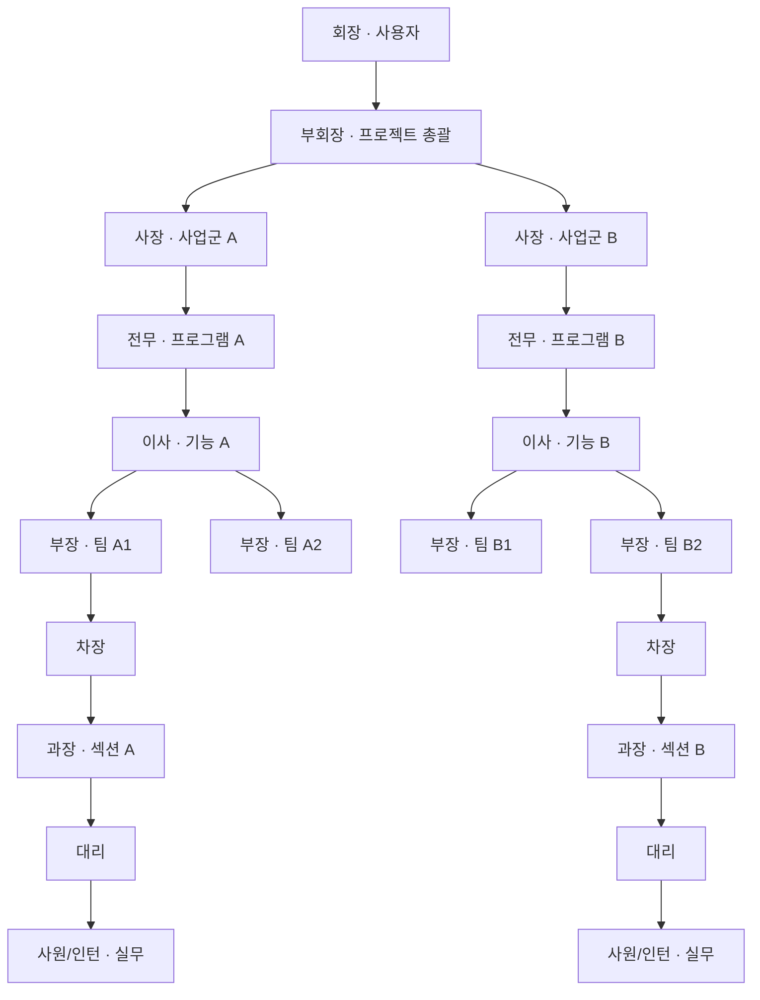

# 참고 수직 조직

사용자가 제공한 형태를 Luna Swarm의 동적 팀 모델로 옮긴 예시입니다. 실제 실행은 목표 난이도에 따라 일부 직급을 건너뛰거나 더 많은 병렬 가지를 만듭니다.

효율 규칙 때문에 “직접 작업 없이 하위 노드 하나만 전달하는 관리자”는 생성할 수 없습니다. 깊은 계층을 쓰려면 각 단계가 직접 작업을 소유하거나 두 개 이상의 하위 보고를 실제로 종합해야 합니다.
